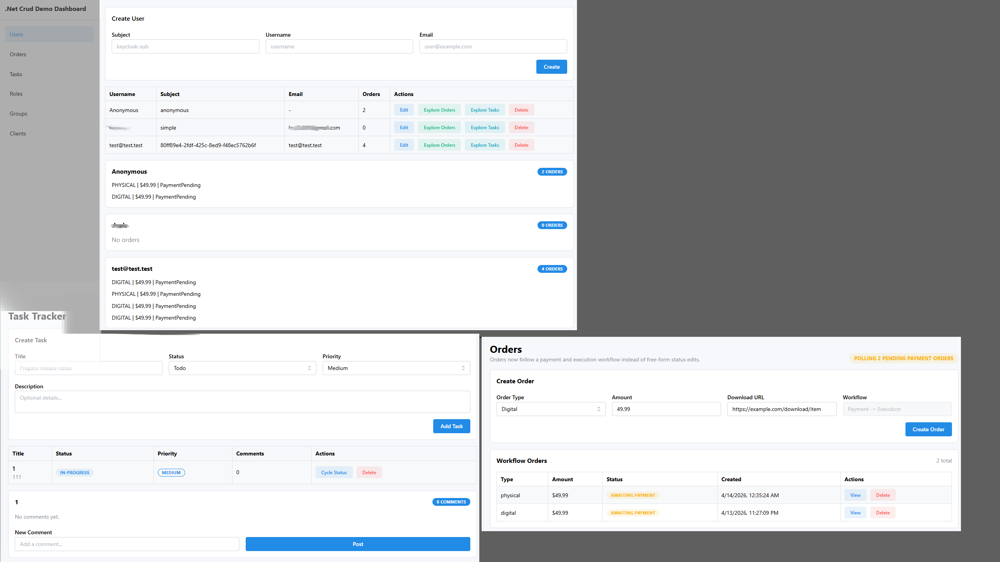

# OpenIddict + Vue Admin Dashboard Demo



A microservices demo application showcasing modern .NET and Vue.js architecture with OpenIddict authentication.

> OpenIddict (hosted inside Auth.Api) + Vue 3.

## Tech Stack

* **OpenIddict 7.5** — OIDC provider hosted inside `backend.Auth.Api`
* **PostgreSQL** — Separate databases per service (Docker/RDS)
* **ASP.NET Core 10** — Web API + EF Core (Npgsql)
* **.NET Aspire** — Service orchestration for local development
* **MediatR** — CQRS pattern implementation
* **RabbitMQ** — Async messaging with Outbox pattern
* **Vue 3 + Vite + Bun** — Frontend (replaces React)
* **Vuetify + Pinia + @tanstack/vue-query + oidc-client-ts** — Vue UI + state + auth

---

## Project Structure

```text
Vue-Net-Admin-Demo/
├─ docker-compose.yml             # Production-like deployment
├─ Readme.md
├─ Docs/                          # Architecture & design docs
│  ├─ Changelog.md
│  ├─ 1. Startup.md
│  ├─ 2. MediatR.md
│  ├─ 3. Mapperly.md
│  ├─ 5. Microservices.md
│  ├─ 6. Saga pattern.md
│  └─ ...
├─ backend/
│  ├─ backend.slnx                # Solution file
│  ├─ backend.AppHost/            # .NET Aspire orchestrator
│  ├─ backend.ServiceDefaults/    # Shared Aspire defaults (JwtBearer)
│  ├─ backend.Api/                # Main API gateway (port 5000)
│  ├─ backend.Auth.Api/           # Auth microservice + OpenIddict (port 5001)
│  ├─ backend.Users.Api/          # Users microservice (port 5005)
│  ├─ backend.Tasks.Api/          # Tasks microservice (port 5002)
│  ├─ backend.Tasks/              # Tasks business logic
│  ├─ backend.Orders.Api/         # Orders microservice (port 5003)
│  ├─ backend.Orders/             # Orders business logic + Saga
│  ├─ backend.Payments.Api/       # Payments microservice (port 5004)
│  ├─ backend.Payments/           # Payments business logic
│  ├─ backend.Users/              # Users business logic
│  ├─ backend.Domain/             # Shared domain models + EF migrations
│  ├─ backend.Infrastructure/     # Shared infrastructure (MediatR, etc.)
│  ├─ backend.Shared/             # Shared configuration & utilities
│  ├─ backend.Tests/              # Unit & integration tests
│  └─ scripts/                    # Migration & startup scripts
├─ frontend/
│  ├─ package.json                # Bun package manager
│  ├─ vite.config.ts
│  ├─ Dockerfile
│  ├─ nginx.conf
│  ├─ .env.example
│  └─ src/
│     ├─ main.ts
│     ├─ App.vue
│     ├─ composables/
│     │  └─ useAuth.ts            # OIDC UserManager wrapper
│     ├─ api/
│     │  └─ index.ts              # Axios instance + API methods
│     ├─ router/
│     │  └─ index.ts              # Vue Router + auth guard
│     ├─ layouts/
│     │  └─ DefaultLayout.vue     # Vuetify app shell
│     └─ pages/
│        ├─ LoginPage.vue
│        ├─ UsersPage.vue
│        ├─ TasksPage.vue
│        ├─ OrdersPage.vue
│        ├─ OrderDetailsPage.vue
│        ├─ RolesPage.vue
│        ├─ GroupsPage.vue
│        └─ ClientsPage.vue
├─ infra/                         # Infrastructure (Caddy, Nginx SSL)
├─ scripts/                       # Deployment & DB scripts
└─ memory/                        # Dev session notes
```

---

## Architecture

### Microservices

| Service | Port | Database | Description |
|---------|------|----------|-------------|
| backend.Api | 5000 | n/a | Main API gateway |
| backend.Auth.Api | 5001 | keycloak_demo_auth | Auth service + **OpenIddict** |
| backend.Tasks.Api | 5002 | keycloak_demo_tasks | Task management |
| backend.Orders.Api | 5003 | keycloak_demo_orders | Order processing + Saga |
| backend.Payments.Api | 5004 | keycloak_demo_payments | Payment processing |
| backend.Users.Api | 5005 | keycloak_demo_auth | User management |

### Key Patterns

- **CQRS** - Command/Query separation via MediatR
- **Outbox Pattern** - Reliable messaging with RabbitMQ
- **Saga Pattern** - Distributed transaction management for Orders→Payments flow
- **Domain Events** - OrderStatusChanged, PaymentCompleted, etc.
- **Authorization Code + PKCE** — OIDC flow for the Vue.js SPA

### Authentication

OpenIddict is hosted inside `backend.Auth.Api` (port 5001). The Vue.js frontend authenticates via:

- **Client ID:** `vue-client` (public, authorization code + PKCE)
- **Scopes:** `openid profile email roles offline_access`
- **Authority:** `http://localhost:5001`
- **Default admin:** username `admin`, password `Admin@123`, role `admin`

---

## Quick Start

### Option 1: Docker Compose (Production-like)

```bash
# Run migrations (applies AuthDbContext + OpenIddict tables, etc.)
docker compose build backend_migrations
docker compose run --rm backend_migrations

# Start all services
docker compose up --build
```

**Services:**
- Frontend: `http://localhost:5173`
- Auth API (OpenIddict): `http://localhost:5001`
- API gateway: `http://localhost:5000`
- Tasks API: `http://localhost:5002`
- Orders API: `http://localhost:5003`
- Payments API: `http://localhost:5004`
- Users API: `http://localhost:5005`
- RabbitMQ: `http://localhost:15672` (guest/guest)

### Option 2: .NET Aspire (Local Development)

```bash
cd backend
dotnet run --project backend.AppHost
```

This starts all microservices with the Aspire dashboard.

### Option 3: Individual Services

```bash
# Start infrastructure
docker compose up -d rabbitmq

# Run migrations (see Migration Commands section below)
cd backend
%USERPROFILE%\.dotnet\tools\dotnet-ef database update --context AuthDbContext --startup-project backend.Auth.Api --project backend.Domain

# Start backend
dotnet run --project backend.Auth.Api

# Start frontend
cd ../frontend
bun install
bun run dev
```

---

## OpenIddict Configuration

### Frontend Client (seeded on startup)

The `SeedData` hosted service in `backend.Auth.Api` automatically creates:

- **Admin user:** `admin` / `Admin@123` (role: `admin`)
- **Frontend client:** `vue-client` (public, PKCE, authorization code + refresh token)

### Registering Additional Clients

You can register new clients via the `SeedData` class or programmatically using `AuthDbContext`:

```csharp
var client = new OpenIddictEntityFrameworkCoreApplication
{
    ClientId = "my-client",
    ClientType = "public",
    ConsentType = "explicit",
    Permissions = JsonSerializer.Serialize(new[]
    {
        "openiddict:permissions:endpoints:token",
        "openiddict:permissions:grants:authorization_code",
        "openiddict:permissions:grants:refresh_token",
        "openiddict:permissions:scopes:openid",
        "openiddict:permissions:scopes:profile",
        "openiddict:permissions:scopes:email",
        "openiddict:permissions:scopes:roles",
    }),
    RedirectUris = JsonSerializer.Serialize(new[]
    { "http://localhost:5173/" }),
};
dbContext.Applications.Add(client);
await dbContext.SaveChangesAsync();
```

---

## Environment Variables

Docker Compose uses these environment variables (see `.env` or set directly):

```env
# Database
RDS_ENDPOINT=localhost
APP_DB_USERNAME=app
APP_DB_PASSWORD=app
AUTH_DB_USERNAME=auth
AUTH_DB_PASSWORD=auth

# OpenIddict (Frontend)
VITE_AUTHORITY=http://localhost:5001
VITE_API_URL=
VITE_API_PROXY_TARGET=http://localhost:5000
```

---

## Frontend Stack

- **Vue 3** + TypeScript (Composition API)
- **Vite 7** — Build tool
- **Bun** — Package manager & runtime
- **Vuetify** — UI components
- **Pinia** — State management
- **Vue Router** — Navigation + auth guard
- **@tanstack/vue-query** — Data fetching
- **oidc-client-ts** — OIDC authentication

### Frontend Pages

| Page | Route | Description |
|------|-------|-------------|
| Users | `/users` | CRUD, explore links to orders/tasks |
| Tasks | `/tasks` | CRUD, comments, status cycling, priority |
| Orders | `/orders` | CRUD, `asUserId` filter |
| Order Details | `/orders/:id` | Saga timeline, polling for PaymentPending, retry payment |
| Roles | `/roles` | Read-only list from `/api/tasks/debugroles` |
| Groups | `/groups` | Read-only from token `profile.groups` |
| Clients | `/clients` | Read-only from token `azp`/`aud` claims |

---

## Development Notes

### Running Migrations

```powershell
cd D:\Repos\Interview\Vue-Net-Admin-Demo\backend

# AuthDbContext — OpenIddict tables + PasswordHash + Roles (critical for migration)
%USERPROFILE%\.dotnet\tools\dotnet-ef database update --context AuthDbContext --startup-project backend.Auth.Api --project backend.Domain

# TasksDbContext — task status/priority defaults
%USERPROFILE%\.dotnet\tools\dotnet-ef database update --context TasksDbContext --startup-project backend.Tasks.Api --project backend.Domain

# OrdersDbContext — initial tables
%USERPROFILE%\.dotnet\tools\dotnet-ef database update --context OrdersDbContext --startup-project backend.Orders.Api --project backend.Domain

# PaymentsDbContext — initial tables
%USERPROFILE%\.dotnet\tools\dotnet-ef database update --context PaymentsDbContext --startup-project backend.Payments.Api --project backend.Domain

# List pending migrations for any context
%USERPROFILE%\.dotnet\tools\dotnet-ef migrations list --context AuthDbContext --startup-project backend.Auth.Api --project backend.Domain
```

### Testing

```bash
cd backend/backend.Tests
dotnet test
```

### Building the Frontend

```bash
cd frontend
bun install
bun run build   # Production build
bun run dev     # Development server (port 5173)
```

### AWS Deployment

Run `scripts/deploy.sh` locally (uses AWS credentials):
- Creates/updates IAM role policies
- Provisions EC2 and RDS
- Creates the auth/tasks/orders/payments databases on the target RDS instance
- Starts the Docker Compose stack on EC2, including frontend, gateway, RabbitMQ, and the backend microservices

The `backend.AppHost` `aws` launch profile is not a deployment mechanism. It only starts the AppHost locally with AWS-oriented configuration.

---

## Migration from Keycloak → OpenIddict

### What Changed on Backend

- **OpenIddict 7.5** hosted inside `backend.Auth.Api` (port 5001)
- `AddJwtBearer` replaces `AddJwtBearer<KeycloakJwtExtensions>` in `backend.ServiceDefaults`
- All microservices now use standard JWT Bearer with `http://localhost:5001` authority
- AuthDbContext migration `20260602160009_InitialOpenIddict` adds OpenIddict tables (`applications`, `authorizations`, `tokens`) + `PasswordHash`/`Roles` columns to `app_users`

### What Changed on Frontend

- **React → Vue 3** (Vuetify replaces Mantine/Refine)
- **Keycloak JS → oidc-client-ts** with `vue-client` public client
- All pages rewritten as Vue SFCs with Composition API
- Auth guard in Vue Router ensures OIDC token before route access
- Vite proxy handles `/connect/*` (OIDC endpoints) + `/api/*` (backend)
